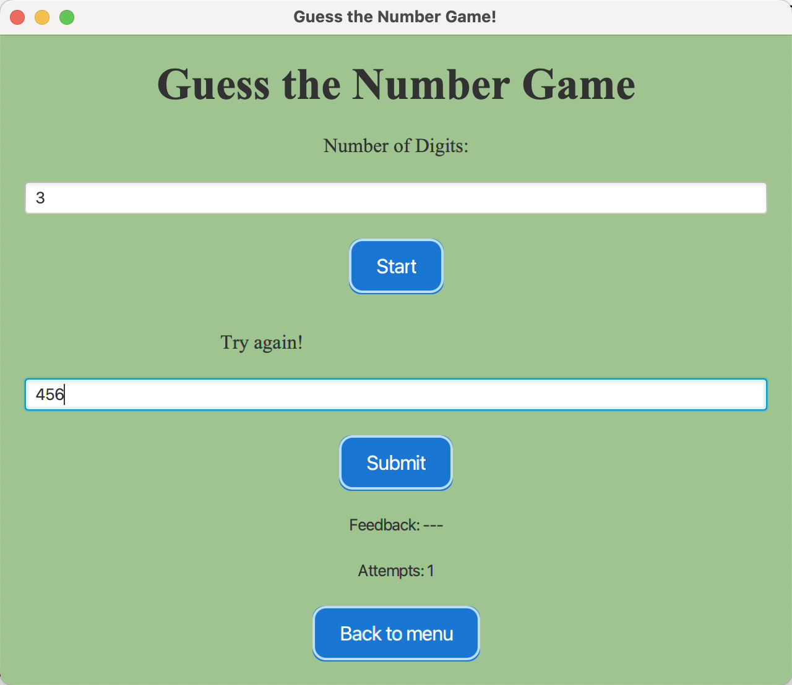

# Guess Number Game

## Description
The Guess Number Game is a JavaFX-based application where users attempt to guess a randomly generated number. 
Players can customize the number of digits (1 to 10) and receive feedback for each guess using symbols:
- `+`: Correct digit and correct position.
- `*`: Correct digit but incorrect position.
- `-`: Digit not in the number.

The game tracks the number of attempts and provides an intuitive GUI with customizable background color.

## Features
- **Customizable digit length**: Play with numbers from 1 to 10 digits.
- **Feedback system**:
  - `+`: Correct digit and position.
  - `*`: Correct digit, wrong position.
  - `-`: Digit not present.
- **Attempt counter**: Tracks the number of guesses made.
- **Clean GUI**: Modern interface with a customizable background color.
- **Random secret number generation**: Ensures unique and unpredictable gameplay.

## How to Play
1. Enter the number of digits you want to guess (1 to 10).
2. Start the game, and a secret number will be generated.
3. Enter your guess in the input field and press **Submit**.
4. Receive feedback:
   - `+`: Correct digit and position.
   - `*`: Correct digit, wrong position.
   - `-`: Digit not in the number.
5. Keep guessing until you receive only `+` symbols, indicating you've won.
6. The attempt counter displays how many tries you've made.

## Project Structure
```
src/
├── controllers/
│   ├── menuController.java    # controller for the menu-screen
│   ├── instructionController.java   #controller for the instruction-screen
│   ├── HelloController.java     #controller for the play-game-screen, main logic of the game
│
│
├── views/
│   ├── menu.fxml           #lay out of the menu-screen    
│   ├── instruction.fxml    #lay out of the instruction-screen
│   ├── play-game.fxml      #lay out of the play-game-screen
│
├── HelloApplication.java                  # Entry point for the application
│
resources/
├── menu.css                 # CSS file for customizing the UI of menu-screen
├── instruction.css          # CSS file for customizing the UI of instruction-screen
├── styles.css               # CSS file for customizing the UI of play-game-screen
│
README.md                      # This file
```

## Screenshots



